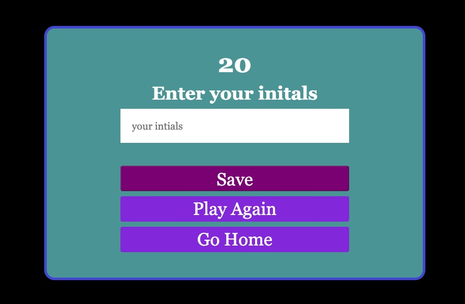

# Code_Quiz

Multiple choice quiz created to test a person's Javascript knowledge.

There are 5 questions, each with 4 possible answers. The questions are randomly presented to the user.

The user has 60 seconds to complete the quiz.
Each time the user gets a question correct, the choice will quickly flash green.
Each time the user gets a questions incorrect, the choice will quicky flash red and 10 seonds will be deducted from the time remaining.

The game is over once the user has answered all of the questions or the time remaining reaches 0.

When the game is over, the user will be prompted to enter in their initals. At that screen the user may start the game over or return to the home screen.

After the user enters in their initials, they will be taken to the high scores page. There they will see all the high scores logged for this game.
The user may then return to the home screen.

